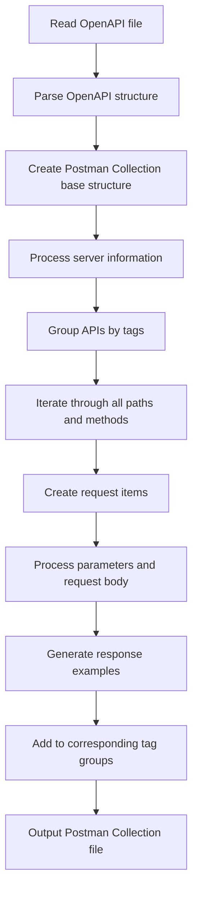
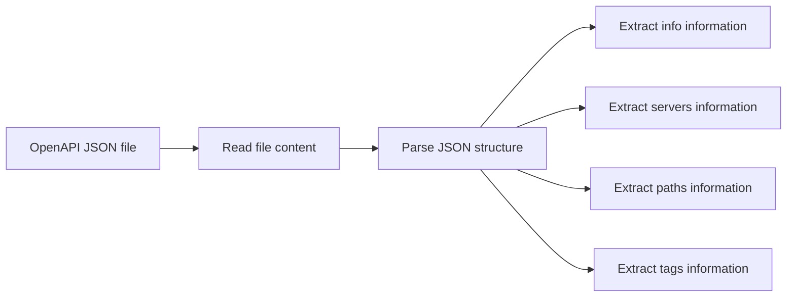
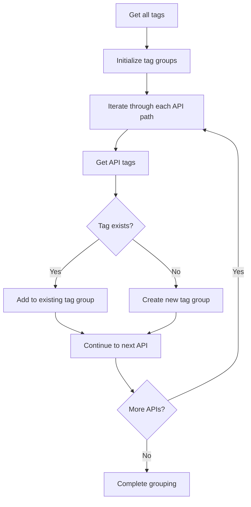
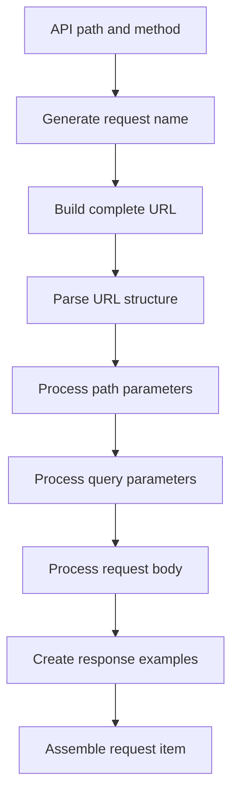
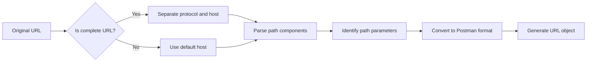

# OpenAPI 3.0.3 to Postman Collection v2.1 Converter

## Project Overview

This is a Python script that converts OpenAPI 3.0.3 specification files to Postman Collection v2.1 format. This tool helps testing teams quickly convert OpenAPI documentation exported from RAP interface management platform into API collections that can be directly imported and used in Postman.

## Features

- ✅ Supports OpenAPI 3.0.3 specification
- ✅ Generates Postman Collection v2.1 format
- ✅ Automatically groups API interfaces by tags
- ✅ Supports path parameters and query parameters
- ✅ Handles request body and response examples
- ✅ Maintains complete API documentation structure
- ✅ Supports multiple HTTP methods (GET, POST, PUT, DELETE, PATCH, HEAD, OPTIONS)

## Script Structure

```
convert_openapi_to_postman.py
├── Main function: convert_openapi_to_postman()
│   ├── File reading and parsing
│   ├── Create Postman Collection base structure
│   ├── Process server information
│   ├── Group APIs by tags
│   └── Output file generation
├── Helper function: create_request_item()
│   ├── Generate request name
│   ├── Build complete URL
│   ├── Process parameters and request body
│   └── Create response examples
├── URL parsing function: parse_url()
│   ├── Separate protocol and host
│   ├── Parse path components
│   └── Handle path parameters
├── Request body processing: create_request_body()
│   └── Generate JSON format request body
└── Response example processing: create_response_examples()
    └── Generate response example array
```

## Usage

### 1. Environment Requirements

- Python 3.6+
- Standard libraries: json, uuid, re, datetime

### 2. Basic Usage

```bash
# Run script directly
python convert_openapi_to_postman.py
```

### 3. Custom Usage

```python
from convert_openapi_to_postman import convert_openapi_to_postman

# Convert custom file
convert_openapi_to_postman(
    openapi_file_path="your_openapi_file.json",
    output_file_path="your_postman_collection.json"
)
```

### 4. Input File Format

The input file must be a JSON file conforming to OpenAPI 3.0.3 specification, containing the following required fields:

```json
{
  "openapi": "3.0.3",
  "info": {
    "title": "API Title",
    "description": "API Description"
  },
  "servers": [
    {
      "url": "https://api.example.com"
    }
  ],
  "paths": {
    "/api/endpoint": {
      "get": {
        "tags": ["tag1"],
        "summary": "Endpoint description",
        "parameters": [...],
        "responses": {...}
      }
    }
  }
}
```

## Implementation Logic

### Core Conversion Process



### Detailed Implementation Logic

#### 1. File Reading and Parsing


#### 2. Tag Grouping Logic


#### 3. Request Item Creation Process


#### 4. URL Parsing Logic


## Core Function Descriptions

### 1. `convert_openapi_to_postman(openapi_file_path, output_file_path)`
- **Function**: Main conversion function
- **Parameters**: 
  - `openapi_file_path`: OpenAPI file path
  - `output_file_path`: Output Postman file path
- **Returns**: No return value, directly generates file

### 2. `create_request_item(path, method, method_data, base_url)`
- **Function**: Create single API request item
- **Parameters**:
  - `path`: API path
  - `method`: HTTP method
  - `method_data`: Method detailed information
  - `base_url`: Base URL
- **Returns**: Postman request item object

### 3. `parse_url(url)`
- **Function**: Parse URL and extract path parameters
- **Parameters**: `url` - Original URL string
- **Returns**: Postman URL object

### 4. `create_request_body(request_body)`
- **Function**: Create request body
- **Parameters**: `request_body` - OpenAPI request body definition
- **Returns**: Postman request body object

### 5. `create_response_examples(responses)`
- **Function**: Create response examples
- **Parameters**: `responses` - OpenAPI response definition
- **Returns**: Postman response example array

## Output Format

Generated Postman Collection v2.1 file structure:

```json
{
  "info": {
    "_postman_id": "uuid",
    "name": "API Collection",
    "description": "API Description",
    "schema": "https://schema.getpostman.com/json/collection/v2.1.0/collection.json"
  },
  "item": [
    {
      "name": "Tag group name",
      "description": "Tag group description",
      "item": [
        {
          "name": "API name",
          "request": {
            "method": "GET",
            "header": [],
            "url": {
              "raw": "https://api.example.com/path",
              "protocol": "https",
              "host": ["api", "example", "com"],
              "path": ["path"],
              "variable": []
            },
            "body": {}
          },
          "response": []
        }
      ]
    }
  ]
}
```

## Important Notes

1. **File Encoding**: Ensure OpenAPI files use UTF-8 encoding
2. **Path Parameters**: The script automatically converts OpenAPI path parameters `{param}` to Postman format `:param`
3. **Tag Grouping**: APIs without tags will be categorized into "Uncategorized" group
4. **Server Information**: If no servers are defined in the OpenAPI file, default values will be used
5. **Response Examples**: Only numeric status codes are processed, "default" responses are ignored

## Error Handling

The script includes basic error handling mechanisms:
- File reading errors
- JSON parsing errors
- File writing errors

## Extensibility

The script is designed with good extensibility and can easily add the following features:
- Support for more OpenAPI fields
- Custom output formats
- Batch file processing
- Command line argument support
- Configuration file support 
