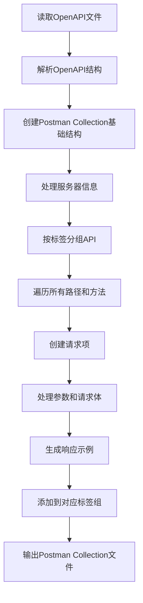
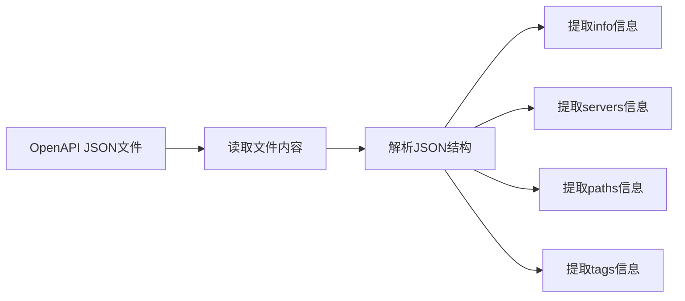
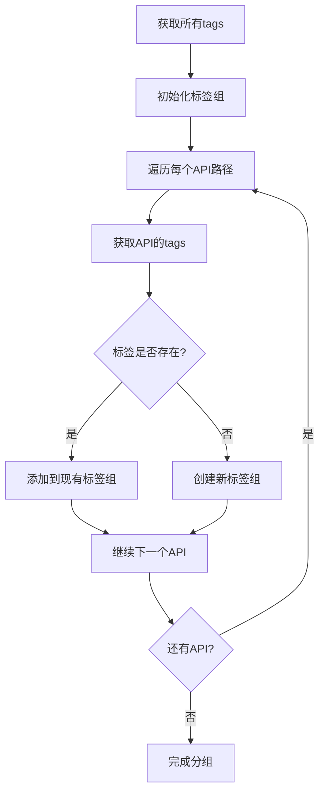
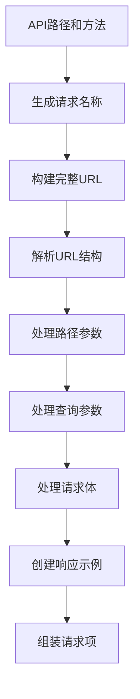
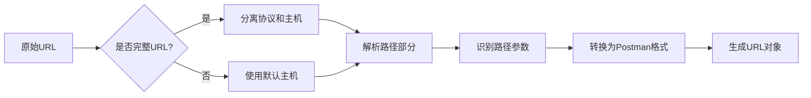

# OpenAPI 3.0.3 到 Postman Collection v2.1 转换器

## 项目概述

这是一个将 OpenAPI 3.0.3 规范文件转换为 Postman Collection v2.1 格式的 Python 脚本。该工具可以帮助测试团队快速将RAP接口管理平台导出的 OpenAPI 文档转换为可在 Metersphere/Postman 中直接导入使用的 API 集合。

## 功能特性

- ✅ 支持 OpenAPI 3.0.3 规范
- ✅ 生成 Postman Collection v2.1 格式
- ✅ 自动按标签分组 API 接口
- ✅ 支持路径参数和查询参数
- ✅ 处理请求体和响应示例
- ✅ 保持 API 文档的完整结构
- ✅ 支持多种 HTTP 方法 (GET, POST, PUT, DELETE, PATCH, HEAD, OPTIONS)

## 脚本结构

```
convert_openapi_to_postman.py
├── 主函数: convert_openapi_to_postman()
│   ├── 文件读取和解析
│   ├── 创建Postman Collection基础结构
│   ├── 处理服务器信息
│   ├── 按标签分组API
│   └── 输出文件生成
├── 辅助函数: create_request_item()
│   ├── 生成请求名称
│   ├── 构建完整URL
│   ├── 处理参数和请求体
│   └── 创建响应示例
├── URL解析函数: parse_url()
│   ├── 分离协议和主机
│   ├── 解析路径部分
│   └── 处理路径参数
├── 请求体处理: create_request_body()
│   └── 生成JSON格式请求体
└── 响应示例处理: create_response_examples()
    └── 生成响应示例数组
```

## 使用方法

### 1. 环境要求

- Python 3.6+
- 标准库：json, uuid, re, datetime

### 2. 基本使用

```bash
# 直接运行脚本
python convert_openapi_to_postman.py
```

### 3. 自定义使用

```python
from convert_openapi_to_postman import convert_openapi_to_postman

# 转换自定义文件
convert_openapi_to_postman(
    openapi_file_path="your_openapi_file.json",
    output_file_path="your_postman_collection.json"
)
```

### 4. 输入文件格式

输入文件必须是符合 OpenAPI 3.0.3 规范的 JSON 文件，包含以下必要字段：

```json
{
  "openapi": "3.0.3",
  "info": {
    "title": "API Title",
    "description": "API Description"
  },
  "servers": [
    {
      "url": "https://api.example.com"
    }
  ],
  "paths": {
    "/api/endpoint": {
      "get": {
        "tags": ["tag1"],
        "summary": "Endpoint description",
        "parameters": [...],
        "responses": {...}
      }
    }
  }
}
```

## 实现逻辑

### 核心转换流程



### 详细实现逻辑

#### 1. 文件读取和解析


#### 2. 标签分组逻辑


#### 3. 请求项创建流程


#### 4. URL解析逻辑


## 核心函数说明

### 1. `convert_openapi_to_postman(openapi_file_path, output_file_path)`
- **功能**: 主转换函数
- **参数**: 
  - `openapi_file_path`: OpenAPI文件路径
  - `output_file_path`: 输出Postman文件路径
- **返回**: 无返回值，直接生成文件

### 2. `create_request_item(path, method, method_data, base_url)`
- **功能**: 创建单个API请求项
- **参数**:
  - `path`: API路径
  - `method`: HTTP方法
  - `method_data`: 方法详细信息
  - `base_url`: 基础URL
- **返回**: Postman请求项对象

### 3. `parse_url(url)`
- **功能**: 解析URL并提取路径参数
- **参数**: `url` - 原始URL字符串
- **返回**: Postman URL对象

### 4. `create_request_body(request_body)`
- **功能**: 创建请求体
- **参数**: `request_body` - OpenAPI请求体定义
- **返回**: Postman请求体对象

### 5. `create_response_examples(responses)`
- **功能**: 创建响应示例
- **参数**: `responses` - OpenAPI响应定义
- **返回**: Postman响应示例数组

## 输出格式

生成的Postman Collection v2.1文件结构：

```json
{
  "info": {
    "_postman_id": "uuid",
    "name": "API Collection",
    "description": "API Description",
    "schema": "https://schema.getpostman.com/json/collection/v2.1.0/collection.json"
  },
  "item": [
    {
      "name": "标签组名称",
      "description": "标签组描述",
      "item": [
        {
          "name": "API名称",
          "request": {
            "method": "GET",
            "header": [],
            "url": {
              "raw": "https://api.example.com/path",
              "protocol": "https",
              "host": ["api", "example", "com"],
              "path": ["path"],
              "variable": []
            },
            "body": {}
          },
          "response": []
        }
      ]
    }
  ]
}
```

## 注意事项

1. **文件编码**: 确保OpenAPI文件使用UTF-8编码
2. **路径参数**: 脚本会自动将OpenAPI的路径参数 `{param}` 转换为Postman格式 `:param`
3. **标签分组**: 没有标签的API会被归类到"未分类"组
4. **服务器信息**: 如果OpenAPI文件中没有定义服务器，会使用默认值
5. **响应示例**: 只处理数字状态码，忽略"default"响应

## 错误处理

脚本包含基本的错误处理机制：
- 文件读取错误
- JSON解析错误
- 文件写入错误

## 扩展性

该脚本设计具有良好的扩展性，可以轻松添加以下功能：
- 支持更多OpenAPI字段
- 自定义输出格式
- 批量文件处理
- 命令行参数支持
- 配置文件支持
